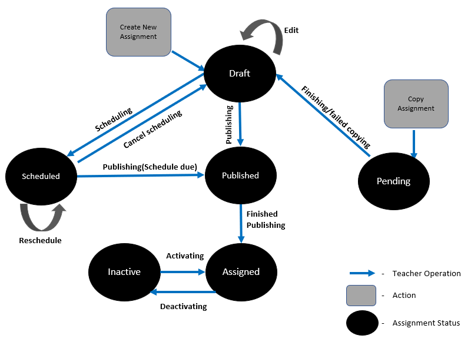

# Status, transitions, and limitations for assignments in Microsoft Graph

Assignments are an important part of the interaction between teachers and students' actions. This article describes the changes in the assignment status during the process flow and which education APIs in Microsoft Graph are involved.

## Assignment status and transitions

An assignment represents a task or unit of work assigned to a student or team member in a class as part of their study. Only teachers or team owners can create, copy, or schedule assignments. These actions have an impact on assignment status. The following table lists the assignment status and the APIs that are available to change the status. 

| Status | Description | REST API call | Features available to edit |
|:--|:--|:--|:--|
| Draft | Initial status when a new assignment is created or copied from an existing assignment. | `POST /education/classes/{id}/assignments` | Resources, categories, rubrics |
| Published | A background processing status  when the assignment is distributed to each student assigned. | `POST /education/classes/{id}/assignments/{id}/publish` | |
| Scheduled | Status when the teacher scheduled the assignment to publish at a future time. | `PATCH /education/classes/{id}/assignments/{id}` `POST /education/classes/{id}/assignments/{id}/publish` | Resources, categories, rubrics |
| Assigned | After the publishing process is complete, the assignment is moved to an assigned status, becoming available for the students, or it stays in an active status. | `POST /education/classes/{id}/assignments/{id}/publish` `POST /education/classes/{id}/assignments/{id}/activate` | Submissions |
| Pending | Background processing status when a new assignment is being copied from an existing one. | `PATCH /education/classes/{id}/assignments/{id}` | |
| Inactive | The assignment has no additional action items for teachers and students. | `POST /education/classes/{id}/assignments/{id}/deactivate` | |

The following diagram shows the status transitions that can occur for assignments.

### How to verify that an assignment is published

The caller must use the [GET assignment](/graph/api/educationassignment-get) operation to check the current assignment status and verify that the publishing process succeeded.

### Assignment status transitions based on the allowed actions

| Current assignment status | New action | New status |
|:--|:--|:--|
| Draft | The teacher schedules the assignment | Scheduled |
| Draft | Publish | Published |
| Draft | Edited | Draft |
| Draft | Discarded | |
| Published | Publish finished | Assigned |
| Published | Publish failed | Draft |
| Published | Discarded | |
| Scheduled | Reach due date | Published |
| Scheduled | Cancel schedule | Draft |
| Scheduled | Reschedule | Scheduled |
| Assigned | Discarded | |
| Assigned | Deactivated | Inactive |
| Pending |	Copy completed | Draft |
| Pending | Discarded | |
| Inactive | Activated | Assigned |

> [!NOTE]
> Only actions and status transitions listed in the table are allowed.

### Sync vs. async operations over assignments API calls

The following table lists the API calls that affect the assignment status and operation type.

Synchronous operations are executed one at a time. Each operation must be completed before the next one can begin, and the final result is only returned once all operations have finished.
Asynchronous operations allow multiple tasks to run concurrently. While one operation is in progress, another operation can start before the previous one is finished. Asynchronous operations typically involve background activities, and the caller needs to actively check for the result by polling or monitoring until it becomes available.

| API | Sync or async | Mechanism to get latest status |
|:--|:--|:--|
| `DELETE /education/classes/{id}/assignments/{id}` | Async | Poll |
| `POST /education/classes/{id}/assignments/{id}/publish` | Async | Poll |
| `PATCH /education/classes/{id}/assignments/{id}` | Async | Poll |
| `POST /education/classes/{id}/assignments` | Async | Poll |
| `POST /education/classes/{id}/assignments/{id}/deactivate` | Async | Poll |
| `POST /education/classes/{id}/assignments/{id}/activate` | Async | Poll |

### Limits

The following limits apply to all API calls:

* The maximum number of assignment resources are 10 for the teacher.
* The maximum size allowed for resources is 500 MB.
* Throttling limits apply; for details, see [Microsoft Graph throttling guidance](/graph/throttling).

## Related content

- [Status, transitions, and limitations for submissions](./submissions-status-transition.md)
